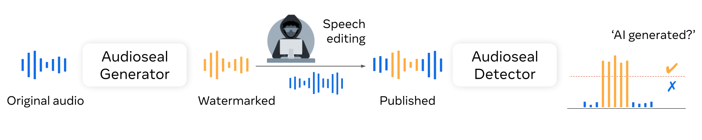

# :loud_sound: AudioSeal: Proactive Localized Watermarking

<a href="https://www.python.org/"></a>
<a href="https://black.readthedocs.io/en/stable/"></a>

We introduce AudioSeal, a method for speech localized watermarking
, with state-of-the-art detector speed without compromising the watermarking robustness. It jointly trains a generator that embeds a watermark in the audio, and a detector that detects the watermarked fragments in longer audios, even in the presence of editing.
Audioseal achieves state-of-the-art detection performance of both natural and synthetic speech at the sample level (1/16k second resolution), it generates limited alteration of signal quality and is robust to many types of audio editing.

<p align="center">

</p>

# Installation :mate:

Audioseal requires Python >=3.8, Pytorch >= 1.13.0, [omegaconf](https://omegaconf.readthedocs.io/), and numpy. To install from PyPI:

```
pip install audioseal
```

To install from source: Clone this repo and install in editable mode:

```
git clone https://github.com/facebookresearch/audioseal
cd audioseal
pip install -e .
```

# :gear: Models

We provide the checkpoints for the following models:

- [AudioSeal Generator](https://dl.fbaipublicfiles.com/audioseal/audioseal_wm_16bits.pth).
  It takes as input an audio signal (as a waveform), and outputs a watermark of the same size as the input, that can be added to the input to watermark it.
  Optionally, it can also take as input a secret message of 16-bits that will be encoded in the watermark.
- [AudioSeal Detector](https://dl.fbaipublicfiles.com/audioseal/audioseal_detector_16bits.pth).
  It takes as input an audio signal (as a waveform), and outputs a probability that the input contains a watermark at each sample of the audio (every 1/16k s).
  Optionally, it may also output the secret message encoded in the watermark.

Note that the message is optional and has no influence on the detection output. It may be used to identify a model version for instance (up to $2**16=65536$ possible choices).

# :abacus: Usage

Audioseal provides a simple API to watermark and detect the watermarks from an audio sample. Example usage:

```python

from audioseal import AudioSeal

# model name corresponds to the YAML card file name found in audioseal/cards
model = AudioSeal.load_generator("audioseal_wm_16bits")

# Other way is to load directly from the checkpoint
# model =  Watermarker.from_pretrained(checkpoint_path, device = wav.device)

watermark = model.get_watermark(wav)

# Optional: you can add a 16-bit message to embed in the watermark
# msg = torch.randint(0, 2, (wav.shape(0), model.msg_processor.nbits), device=wav.device)
# watermark = model.get_watermark(wav, message = msg)

watermarked_audio = wav + watermark

# To detect the messages
detector = AudioSeal.load_detector("audioseal_detector_16bits")
result, message = detector(watermarked_audio)

print(result)  # print prob of watermarked class # should be > 0.5
print(message)  # message will be an empty list if the detector detects no watermarking from the audio
```

<!-- # Want to contribute?

 We welcome [Pull Requests](https://github.com/fairinternal/fair-getting-started-recipe/pulls) with improvements or suggestions.
 If you want to flag an issue or propose an improvement, but dont' know how to realize it, create a [GitHub Issue](https://github.com/fairinternal/fair-getting-started-recipe/issues).


# Thanks to:
* Jack Urbaneck, Matthew Muckley, Pierre Gleize,  Ashutosh Kumar, Megan Richards, Haider Al-Tahan, and Vivien Cabannes for contributions and feedback
* The CIFAR10 [PyTorch Tutorial](https://pytorch.org/tutorials/beginner/blitz/cifar10_tutorial.html
) on which the training is based
* [Hydra Lightning Template](https://github.com/ashleve/lightning-hydra-template) for inspiration on code organization -->

# License

- The code in this repository is released under the MIT license as found in the [LICENSE file](LICENSE).
- The models weights in this repository are released under the CC-BY-NC 4.0 license as found in the [LICENSE_weights file](LICENSE_weights).

# Citation

If you find this repository useful, please consider giving a star :star: and please cite as:

```
@article{sanroman2024proactive,
  title={},
  author={},
  journal={arXiv preprint},
  year={2024}
}
```
